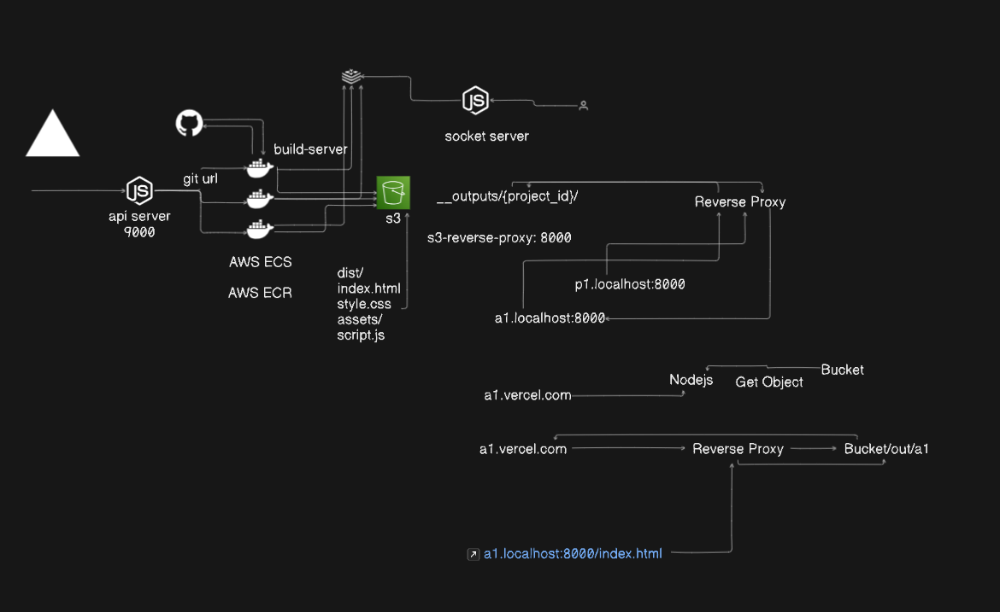

**Vercel Clone with AWS Services**

---

## Introduction

This project is a clone of Vercel, a cloud platform for static sites and serverless functions. It is built using a combination of various AWS services, Docker, Redis, S3, Next.js, TypeScript, Kafka, ClickHouse, and PostgreSQL. This README provides an overview of the project structure, setup instructions, and usage guidelines.

---

## Table of Contents

1. [Features](#features)
2. [Setup](#setup)
    - [Prerequisites](#prerequisites)
    - [Installation](#installation)
3. [Usage](#usage)
4. [Architecture](#architecture)
5. [Technologies Used](#technologies-used)
6. [Contributing](#contributing)
7. [License](#license)

---

## Features

- **Static Site Hosting**: Deploy static sites effortlessly.
- **Serverless Functions**: Execute serverless functions seamlessly.
- **Dockerized Environment**: Ensures consistent development and deployment environments.
- **Cache Management with Redis**: Efficient caching mechanism for enhanced performance.
- **Data Storage with S3**: Scalable and durable object storage for various data types.
- **Frontend Framework with Next.js**: Building powerful, server-rendered React applications.
- **Type Safety with TypeScript**: Enhances code quality and developer productivity.
- **Event Streaming with Kafka**: Enables real-time data processing and event-driven architectures.
- **Analytics with ClickHouse**: High-performance columnar database for analytics workloads.
- **Relational Database with PostgreSQL**: Provides relational data management capabilities.

---

## Setup

### Prerequisites

- AWS Account with necessary permissions.
- Docker installed on your machine.
- Redis, Kafka, ClickHouse, and PostgreSQL setup.
- Node.js and npm installed locally.

### Installation

1. Clone the repository:

    ```bash
    git clone https://github.com/your-repo/vercel-clone.git
    ```

2. Navigate to the project directory:

    ```bash
    cd vercel-clone
    ```

3. Install dependencies:

    ```bash
    npm install
    ```

4. Set up your AWS credentials and configurations.

5. Configure Docker containers for Redis, Kafka, ClickHouse, and PostgreSQL.

6. Update environment variables as per your setup.

---

## Usage

1. Start the development server:

    ```bash
    npm run dev
    ```

2. Access the application at `http://localhost:3000`.

3. Deploy the application to your AWS environment.

---

## Architecture



The architecture consists of various components such as Docker containers, AWS services (S3, Lambda, etc.), Next.js for frontend, Redis for caching, Kafka for event streaming, ClickHouse for analytics, and PostgreSQL for relational data storage.

---

## Technologies Used

- AWS
- Docker
- Redis
- S3
- Next.js
- TypeScript
- Kafka
- ClickHouse
- PostgreSQL

---

## Contributing

Contributions are welcome! Fork the repository, make your changes, and submit a pull request.

---

## License

This project is licensed under the MIT License - see the [LICENSE](LICENSE) file for details.

---

**Note**: Replace placeholders (like `your-repo`, `architecture_diagram.png`, etc.) with actual values pertinent to your project.
